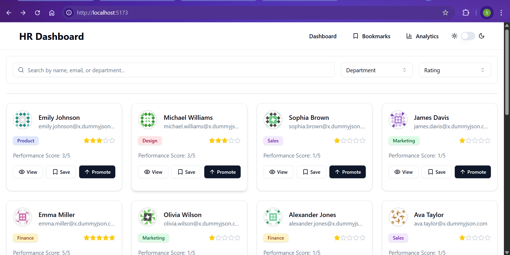
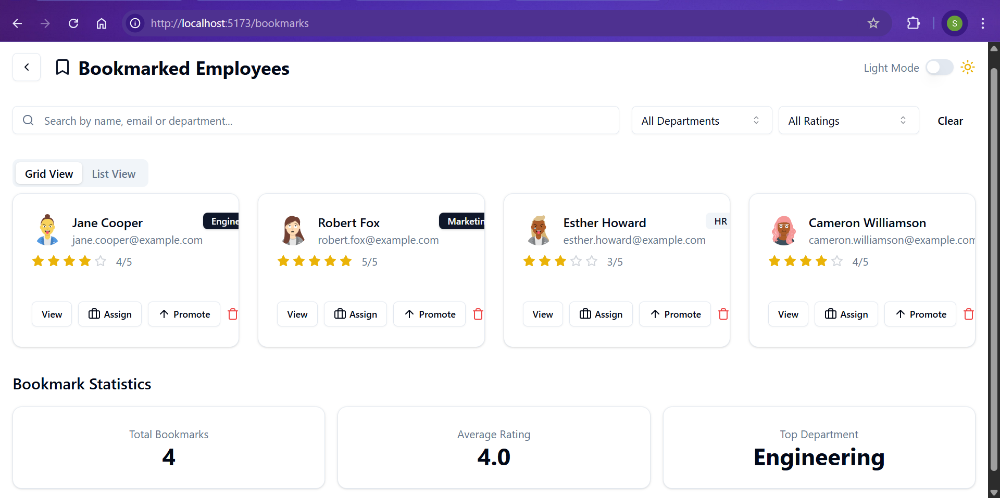
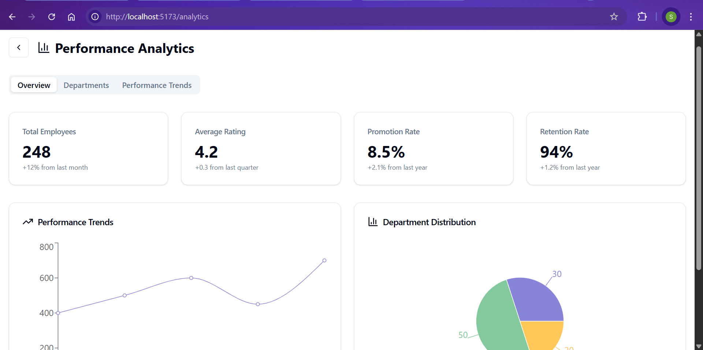

# 💼 FLAMAPP – HR Performance Dashboard

A modern, responsive HR dashboard built with **React**, **TypeScript**, **Tailwind CSS**, and **Vite**.  
Designed for HR managers to track employee performance, manage bookmarks, and view performance analytics.

---

## 🚀 Features

### 🏠 Homepage (`/`)
- Fetches **20 employees** from [dummyjson.com](https://dummyjson.com/users?limit=20)
- **User Cards** display:
  - Name, Email, Age, Department (randomized)
  - Performance Rating: ⭐ 1–5 stars
  - Actions: `View`, `Bookmark`, `Promote`

### 🔍 Search & Filter
- Live search by **name**, **email**, or **department**
- Multi-select filter dropdown for:
  - **Departments**
  - **Performance Ratings**

### 👤 Employee Details (`/employee/[id]`)
- Displays:
  - Address, Phone, Bio, Past Performance History
- **Tabbed UI**:
  - `Overview`, `Projects`, `Feedback`
- Dynamic content loading per tab
- Performance shown using stars and color-coded badges

### 📌 Bookmark Manager (`/bookmarks`)
- View all bookmarked employees
- UI actions available:
  - `Promote`
  - `Assign to Project`
  - `Remove from Bookmarks`

### 📊 Analytics (`/analytics`)
- Interactive charts (mock data):
  - Department-wise average ratings
  - Bookmark trends

---

## 🛠️ Tech Stack

- **React**
- **TypeScript**
- **Vite**
- **Tailwind CSS**
- **Radix UI** (for accessible components)

---

## ⚙️ Getting Started
```bash
cd FLAM_TASK1
```

### 1. Install dependencies
```bash
npm install
```
### 2. Run the app
```bash
npm run dev
```
### 3. Open in your browser
```bash
http://localhost:5173/
```
### ScreenShots


